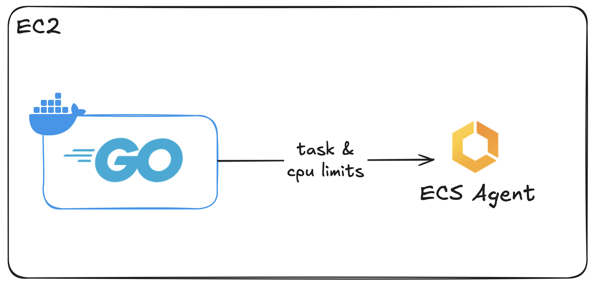

<p align="center">
  
</p>
<div align="center">

[![Build Status][ci-img]][ci] [![Report Card][report-img]][report] [![Test Coverage][cov-img]][cov] ![Release] [![FOSSA Status][fossa-img]][fossa] [![GoDoc][doc-img]][doc] [![License: MIT][mit-img]][mit]

# gomaxecs

</div>

> [!IMPORTANT]
> Go v1.25 does NOT resolve the CFS issue for containers running in ECS. See below for more details.

Package for auto setting GOMAXPROCS based on ECS task and container CPU limits.

Due to Go not being CFS aware https://github.com/golang/go/issues/33803 and because [uber automaxprocs](https://github.com/uber-go/automaxprocs) is unable to set GOMAXPROCS for ECS https://github.com/uber-go/automaxprocs/issues/66. This lead to **gomaxecs**.

## Installation

`go get -u github.com/rdforte/gomaxecs`

## Quick Start

```go
import _ "github.com/rdforte/gomaxecs"

func main() {
  // Your application logic here.
}
```

## Design



## GOMAXPROCS

GOMAXPROCS is an env variable and function from the [runtime package](https://pkg.go.dev/runtime@go1.23.1) that limits the number of operating system threads that can execute user-level Go code simultaneously.

## Why this package exists?

When you run your Go application in ECS you may be setting the cpu of your containers to a certain value, for example 4096 (4 vCPU's) however when you check the value of GOMAXPROCS for your container you may see that it is defaulting to the cpu of the task or virtual machine.

Your first instinct (mine included) was to reach out and use something like [uber automaxprocs](https://github.com/uber-go/automaxprocs) to solve this issue.
You'll soon find though that this did not give you the outcome you were looking for ie: the container cpu value equal to that of GOMAXPROCS.

This is due to the following issue: [issue 66](https://github.com/uber-go/automaxprocs/issues/66) and the fact that our containers are using CFS to manage our resources on the Operating System level and automaxprocs and Go1.25 primarly works on solving the CPU Limits issue for container orchastration technologies like Kubernetes though ECS works on CPU Shares.

How CPU Limits and Shares work for managing the given amount of time a process has on a CPU are fundamentally different.

If you would like to understand more about how these concepts work and the effects that may have on your workloads I have put together a details article explaining the different concepts which you can read here:

**[Go Performance Tuning on Linux. Pt 1 - Building a mental model.](https://ryanforte.tech/blog/chassing-99-percentile-pt-1/)**.

## Word of Caution

Every workload is fundamentally different and aligning GOMAXPROCS to the containers CPU might suit most workloads but not all so I advise you to do your own **Benchmarking** and **Load Testing** to ensure this is the right solution for your workload. How Go treats CPU bound and IO bound workloads is different and you should understand the implications of setting GOMAXPROCS to the containers CPU before using this package.

You can read more about how Go treats CPU bound and IO bound workloads [here](https://ryanforte.tech/blog/chassing-99-percentile-pt-1/).

## Experiment: 1 Task, 2 Containers. Who can calculate the nth Fibonacci number the fastest?

This experiment was ran 5 times from which the averages were taken.

Each experiment consisted of running 1 task with 2 containers each running the same code to calculate the nth Fibonacci number recursively (least optimal) not iteratively (most optimal).

Each experiment ran for 2 minutes where 200 concurrent requests were sent to each container to calculate the 30th Fibonacci number.

A concurrency level of 200 with a Fibonnaci number of 30 was chosen to ensure that the CPU was fully utilised and that we could see the effects of setting GOMAXPROCS to the container CPU.

This experminent is highly biased towards CPU bound workloads and is used to demonstrate the adverse effects of not setting GOMAXPROCS to the conainer CPU.

A still highly advise you to do your own benchmarking and load testing to ensure this is the right solution for your workloads.

#### Experiment 1: (no gomaxecs):

Task CPU = 2048 (2 vCPU's)
Container 1 CPU = 1024 (1 vCPU)
Container 2 CPU = 1024 (1 vCPU)
GOMAXPROCS for each container = 2

Results:

**Container Performance**

| Metric       | Container 1  | Container 2  |
| ------------ | ------------ | ------------ |
| Avg CPU      | 98%          | 98%          |
| Slowest      | 18.4805 secs | 18.5556 secs |
| Fastest      | 0.2209 secs  | 0.2206 secs  |
| Average      | 1.7137 secs  | 1.7043 secs  |
| Requests/sec | 112.7256     | 112.6401     |

**Latency Distribution**

| Percentile | Container 1  | Container 2  |
| ---------- | ------------ | ------------ |
| 10%        | 0.3528 secs  | 0.3888 secs  |
| 25%        | 0.6480 secs  | 0.7305 secs  |
| 50%        | 1.5548 secs  | 1.5370 secs  |
| 75%        | 1.8237 secs  | 1.8378 secs  |
| 90%        | 2.8999 secs  | 2.9015 secs  |
| 95%        | 3.9617 secs  | 3.8003 secs  |
| 99%        | 10.5919 secs | 10.4050 secs |

#### Experiment 2: (gomaxecs):

Task CPU = 2048 (2 vCPU's)
Container 1 CPU = 1024 (1 vCPU)
Container 2 CPU = 1024 (1 vCPU)
GOMAXPROCS for each container = 1

Results:

**Container Performance**

| Metric       | Container 1 | Container 2 |
| ------------ | ----------- | ----------- |
| Avg CPU      | 98%         | 98%         |
| Slowest      | 3.1090 secs | 3.2550 secs |
| Fastest      | 0.2449 secs | 0.2311 secs |
| Average      | 1.5775 secs | 1.5603 secs |
| Requests/sec | 125.9529    | 127.4654    |

**Latency Distribution**

| Percentile | Container 1 | Container 2 |
| ---------- | ----------- | ----------- |
| 10%        | 1.5595 secs | 1.5419 secs |
| 25%        | 1.5809 secs | 1.5638 secs |
| 50%        | 1.6015 secs | 1.5822 secs |
| 75%        | 1.6253 secs | 1.6019 secs |
| 90%        | 1.6479 secs | 1.6227 secs |
| 95%        | 1.6599 secs | 1.6386 secs |
| 99%        | 1.6893 secs | 1.6952 secs |

## Go 1.25

The below experiment shows 2 containers each running with the following configuration:

- Go v1.25
- vCPU: 4096 (4)

#### Task Definition

Some fields have been omitted for brevity.

```
{
  "compatibilities": [
    "EC2",
    "FARGATE"
  ],
  "containerDefinitions": [
    {
      "cpu": 4096,
      "name": "c1",
    },
    {
      "cpu": 4096,
      "name": "c2",
    }
  ],
  "cpu": "8192",
  "memory": "16384",
  "requiresCompatibilities": [
    "FARGATE"
  ],
  "runtimePlatform": {
    "cpuArchitecture": "X86_64",
    "operatingSystemFamily": "LINUX"
  },
}

```

#### CloudWatch Logs (Without gomaxecs)

| Timestamp (UTC+10:00)    | Message              | Container |
| ------------------------ | -------------------- | --------- |
| August 30, 2025 at 16:13 | Go version: go1.25.0 | c1        |
| August 30, 2025 at 16:13 | GOMACPROCS: 8        | c1        |
| August 30, 2025 at 16:13 | Go version: go1.25.0 | c2        |
| August 30, 2025 at 16:13 | GOMACPROCS: 8        | c2        |

**Expected Result:** GOMAXPROCS should be set to 4 as the container is limited to 4 vCPU's.

#### CloudWatch Logs (With gomaxecs)

The below logs show that GOMAXPROCS is correctly set to 4 when using the **gomaxecs** package.

| Timestamp (UTC+10:00)    | Message                                            | Container |
| ------------------------ | -------------------------------------------------- | --------- |
| August 30, 2025 at 16:27 | Go version: go1.25.0                               | c1        |
| August 30, 2025 at 16:27 | GOMACPROCS: 4                                      | c1        |
| August 30, 2025 at 16:27 | 2025/08/30 06:27:35 maxprocs: Updated GOMAXPROCS=4 | c1        |
| August 30, 2025 at 16:27 | Go version: go1.25.0                               | c2        |
| August 30, 2025 at 16:27 | GOMACPROCS: 4                                      | c2        |
| August 30, 2025 at 16:27 | 2025/08/30 06:27:35 maxprocs: Updated GOMAXPROCS=4 | c2        |

## Debugging

To enable debug logging set the env variable `GOMAXECS_DEBUG` to `true` or `1`.

```shell
export GOMAXECS_DEBUG=true
```

or

```shell
export GOMAXECS_DEBUG=1
```

This will increase the verbosity of the logs output by the package and help with debugging any issues.

## Contribution

If anyone has any good ideas on how this package can be improved, all contributions are welcome.

## References

- [100 Go Mistakes](https://100go.co/?h=kubernetes#not-understanding-the-impacts-of-running-go-in-docker-and-kubernetes-100) was the main source of inspiration for this package. The examples were borrowed from
  the book and modified to suit ECS.
- [Go 1.25 Release Notes](https://tip.golang.org/doc/go1.25#container-aware-gomaxprocs)

<hr>

Released under the [MIT License](LICENSE).

[doc-img]: https://godoc.org/github.com/rdforte/gomaxecs?status.svg
[doc]: https://godoc.org/github.com/rdforte/gomaxecs
[ci-img]: https://github.com/rdforte/gomaxecs/actions/workflows/build.yml/badge.svg
[ci]: https://github.com/rdforte/gomaxecs/actions/workflows/build.yml
[mit-img]: https://img.shields.io/badge/License-MIT-yellow.svg
[mit]: https://github.com/rdforte/gomaxecs/blob/main/LICENSE
[cov-img]: https://codecov.io/github/rdforte/gomaxecs/graph/badge.svg
[cov]: https://codecov.io/github/rdforte/gomaxecs
[fossa-img]: https://app.fossa.com/api/projects/custom%2B49223%2Fgithub.com%2Frdforte%2Fgomaxecs.svg?type=small
[fossa]: https://app.fossa.com/projects/custom%2B49223%2Fgithub.com%2Frdforte%2Fgomaxecs?ref=badge_small
[report-img]: https://goreportcard.com/badge/github.com/rdforte/gomaxecs
[report]: https://goreportcard.com/report/github.com/rdforte/gomaxecs
[release]: https://img.shields.io/github/v/release/rdforte/gomaxecs
