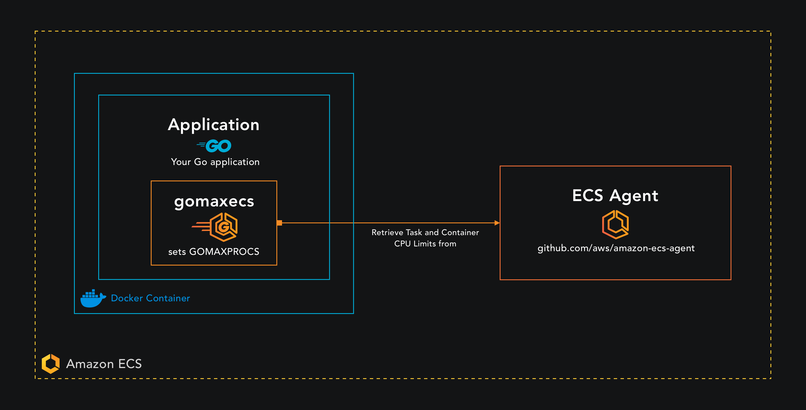

<p align="center">
  
</p>
<div align="center">

[![Build Status][ci-img]][ci] [![Report Card][report-img]][report] [![Test Coverage][cov-img]][cov] ![Release] [![FOSSA Status][fossa-img]][fossa] [![GoDoc][doc-img]][doc] [![License: MIT][mit-img]][mit]

# gomaxecs

</div>

> [!IMPORTANT]
> Go v1.25 does NOT resolve the CFS issue for containers running in ECS. See below for more details.

Package for auto setting GOMAXPROCS based on ECS task and container CPU limits.

Due to Go not being CFS aware https://github.com/golang/go/issues/33803 and because [uber automaxprocs](https://github.com/uber-go/automaxprocs) is unable to set GOMAXPROCS for ECS https://github.com/uber-go/automaxprocs/issues/66. This lead to **gomaxecs**.

## Installation

`go get -u github.com/rdforte/gomaxecs`

## Quick Start

```go
import _ "github.com/rdforte/gomaxecs"

func main() {
  // Your application logic here.
}
```

## Design



## Intro to GOMAXPROCS

GOMAXPROCS is an env variable and function from the [runtime package](https://pkg.go.dev/runtime@go1.23.1) that limits the number of operating system threads that can execute user-level Go code simultaneously. If GOMAXPROCS is not set then it will default to [runtime.NumCPU](https://pkg.go.dev/runtime@go1.23.1#NumCPU) which is the number of logical CPU cores available by the current process. For example if I decide to run my Go application on my shiny new 8 core Mac Pro, then GOMAXPROCS will default to 8. We are able to configure the number of system threads our Go application can execute by using the runtime.GOMAXPROCS function to override this default.

## What is CFS

CFS was introduced to the Linux kernel in version [2.6.23](https://kernelnewbies.org/Linux_2_6_23) and is the default process scheduler used in Linux. The main purpose behind CFS is to help ensure that each process gets its own fair share of the CPU proportional to its priority. In Docker every container has access to all the hosts resources, within the limits of the kernel scheduler. Though Docker also provides the means to limit these resources through modifying the containers cgroup on the host machine.

## Performance implications of running Go in Docker

Lets imagine a scenario where we configure our ECS Task to use 8 CPU's and our container to use 4 vCPU's.

```
{
    "containerDefinitions": [
        {
            "cpu": 4096, // Limit container to 4 vCPU's
        }
    ],
    "cpu": "8192", // Task uses 8 CPU's
    "memory": "16384",
    "runtimePlatform": {
        "cpuArchitecture": "X86_64",
        "operatingSystemFamily": "LINUX"
    },
}
```

The ECS Task CPU period is locked into 100ms

[https://github.com/aws/amazon-ecs-agent/blob/d68e729f73e588982dc2189a1c618c18c47c931b/agent/api/task/task_linux.go#L39](https://github.com/aws/amazon-ecs-agent/blob/d68e729f73e588982dc2189a1c618c18c47c931b/agent/api/task/task_linux.go#L39)

The CPU Period refers to the time period in microseconds, where the kernel will do some calculations to figure out the allotted amount of CPU time to provide each task.
In the above configuration this would be 4 vCPU's multiplied by 100ms giving the task 400ms (4 x 100ms).

If all is well and good with our Go application then we would have go routines scheduled on 4 threads across 4 cores.


_Threads scheduled on cores 1, 3, 6, 8_

For each 100ms period our Go application consumes the full 400 out of 400ms, therefore 100% of the CPU quota.

Now Go is **NOT** CFS aware https://github.com/golang/go/issues/33803 therefore GOMAXPROCS will default to using all 8 cores of the Task.


Now we have our Go application using all 8 cores resulting in 8 threads executing go routines. After 50ms of execution we reach our CPU quota 50ms _ 8 threads giving us 400ms (8 _ 50ms).
As a result CFS will throttle our CPU resources, meaning that no more CPU resources will be allocated till the next period. This means our application will be sitting idle doing nothing for
a full 50ms.

If our Go application has an average latency of 50ms this now means a request to our service can take up to 150ms to complete, which is a 300% increase in latency.

## CFS Solution

In Kubernetes this issue is quite easy to solve as we have [uber automaxprocs](https://github.com/uber-go/automaxprocs) to solve this issue. So why not use Uber's automaxprocs then and whats the reason
behind **gomaxecs package**? Well Ubers automaxprocs does not work for ECS https://github.com/uber-go/automaxprocs/issues/66 because the cgroup `cpu.cfs_quota_us` is set to -1 🥲. The workaround for this
is to then leverage [ECS Metadata](https://docs.aws.amazon.com/AmazonECS/latest/developerguide/task-metadata-endpoint.html) as a means to sourcing the container limits and setting GOMAXPROCS at runtime.

## Go 1.25

The below experiment shows 2 containers each running with the following configuration:

- Go v1.25
- vCPU: 4096 (4)

#### Task Definition

Some fields have been omitted for brevity.

```
{
  "compatibilities": [
    "EC2",
    "FARGATE"
  ],
  "containerDefinitions": [
    {
      "cpu": 4096,
      "name": "c1",
    },
    {
      "cpu": 4096,
      "name": "c2",
    }
  ],
  "cpu": "8192",
  "memory": "16384",
  "requiresCompatibilities": [
    "FARGATE"
  ],
  "runtimePlatform": {
    "cpuArchitecture": "X86_64",
    "operatingSystemFamily": "LINUX"
  },
}

```

#### CloudWatch Logs (Without gomaxecs)

| Timestamp (UTC+10:00)    | Message              | Container |
| ------------------------ | -------------------- | --------- |
| August 30, 2025 at 16:13 | Go version: go1.25.0 | c1        |
| August 30, 2025 at 16:13 | GOMACPROCS: 8        | c1        |
| August 30, 2025 at 16:13 | Go version: go1.25.0 | c2        |
| August 30, 2025 at 16:13 | GOMACPROCS: 8        | c2        |

**Expected Result:** GOMAXPROCS should be set to 4 as the container is limited to 4 vCPU's.

#### CloudWatch Logs (With gomaxecs)

The below logs show that GOMAXPROCS is correctly set to 4 when using the **gomaxecs** package.

| Timestamp (UTC+10:00)    | Message                                            | Container |
| ------------------------ | -------------------------------------------------- | --------- |
| August 30, 2025 at 16:27 | Go version: go1.25.0                               | c1        |
| August 30, 2025 at 16:27 | GOMACPROCS: 4                                      | c1        |
| August 30, 2025 at 16:27 | 2025/08/30 06:27:35 maxprocs: Updated GOMAXPROCS=4 | c1        |
| August 30, 2025 at 16:27 | Go version: go1.25.0                               | c2        |
| August 30, 2025 at 16:27 | GOMACPROCS: 4                                      | c2        |
| August 30, 2025 at 16:27 | 2025/08/30 06:27:35 maxprocs: Updated GOMAXPROCS=4 | c2        |

## Contribution

If anyone has any good ideas on how this package can be improved, all contributions are welcome.

## References

- [100 Go Mistakes](https://100go.co/?h=kubernetes#not-understanding-the-impacts-of-running-go-in-docker-and-kubernetes-100) was the main source of inspiration for this package. The examples were borrowed from
  the book and modified to suit ECS.
- [Go 1.25 Release Notes](https://tip.golang.org/doc/go1.25#container-aware-gomaxprocs)

<hr>

Released under the [MIT License](LICENSE).

[doc-img]: https://godoc.org/github.com/rdforte/gomaxecs?status.svg
[doc]: https://godoc.org/github.com/rdforte/gomaxecs
[ci-img]: https://github.com/rdforte/gomaxecs/actions/workflows/build.yml/badge.svg
[ci]: https://github.com/rdforte/gomaxecs/actions/workflows/build.yml
[mit-img]: https://img.shields.io/badge/License-MIT-yellow.svg
[mit]: https://github.com/rdforte/gomaxecs/blob/main/LICENSE
[cov-img]: https://codecov.io/github/rdforte/gomaxecs/graph/badge.svg
[cov]: https://codecov.io/github/rdforte/gomaxecs
[fossa-img]: https://app.fossa.com/api/projects/custom%2B49223%2Fgithub.com%2Frdforte%2Fgomaxecs.svg?type=small
[fossa]: https://app.fossa.com/projects/custom%2B49223%2Fgithub.com%2Frdforte%2Fgomaxecs?ref=badge_small
[report-img]: https://goreportcard.com/badge/github.com/rdforte/gomaxecs
[report]: https://goreportcard.com/report/github.com/rdforte/gomaxecs
[release]: https://img.shields.io/github/v/release/rdforte/gomaxecs
